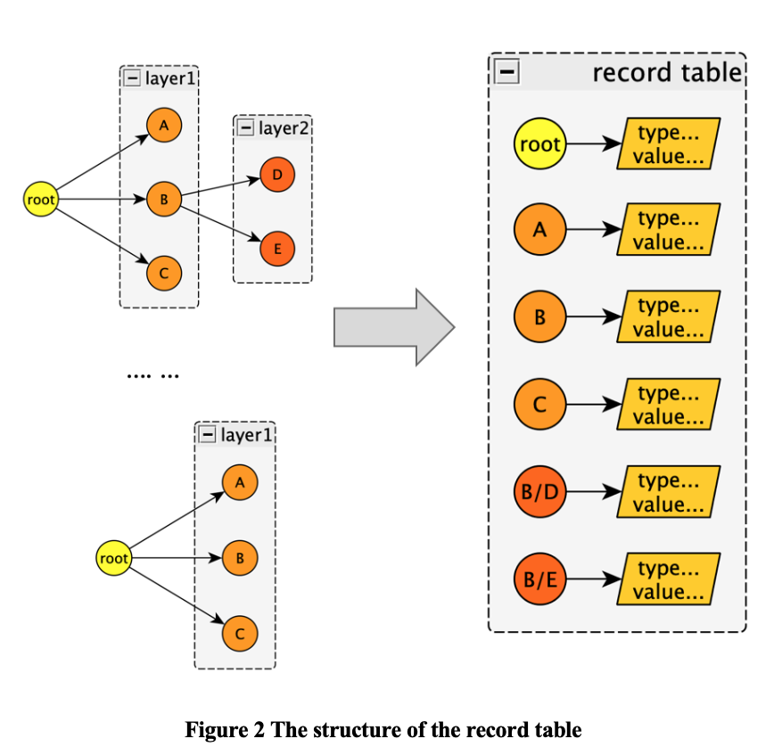

# JSON_Invariants_Detector

## Author
Done by Yufeng Yan and Yinuo Peng.

## ABSTRACT
Nowadays, JSON-based APIs have a wide range of applications in real world. In microservice architectures, services may call other services by JSON-based APIs. In web applications, the front-end and the back-end usually communicate with each other based on JSON. However, in order to maintain consistence, API developers have to write API documents which is always tiresome due to frequent updates of APIs. Our tool, an invariant detector for JSON-based APIs, can solve this problem to some extent. In addition, the tool can be used to validate whether JSON output holds the JSON schema invariants and notify API developers and users when API is updated. The pipeline of the tool can be divided into three stages: converting all possible JSON into JSON schemas, aggregating JSON schemas into the record table, and finally generating invariant-schema. In the experiment, the tool costs less than 1 milliseconds to generate invariant schema and 193 seconds to load 100,000 test cases (with a complicated output example). In addition, 100% of unit test cases pass on simple JSONs. However, the tool needs more tests on some real APIs of some software projects in the future.

## Problem Statement
As a language-independent data format, JSON is very easy to parse and generate. Therefore, JSON-based API is widely used in Microservice architecture and web applications. In a web application, front-end and back-end usually communicate with each other by JSON-based APIs. However, the data structure in JSON is not always fixed. If the output (in form of JSON) of an API changed while the API caller is not informed of this situation, then some bad things would happen. For example, if API callers still use the same method to parse the response body, they may get some serious errors such as keyError. Currently, a common solution to this problem is writing API documents. API developers should write down all possible data structures and their corresponding meanings which the API could generate. Then, API caller could look up this document and use the right way to get the result. However, this process could be very tiresome, given tons of APIs need to update every day.  

## Motivation
To solve the above problem, we intend to design and implement a JSON invariant detector with which we can detect the invariant information of JSON files. Then we can automatically generate an API document using the invariant information. This tool will matter to developers, especially for those people who need to collaborate with other developers. For example, frontend developers need to work closely and communicate with backend developers to make sure the data transmitted by the server can be correctly displayed on the front end, and the data transmitted to the server can be processed correctly by the server. In addition, it is especially useful for micro-service architecture since there are a large number of services that provide plenty of APIs. The API can be called from each other, so it is necessary to determine the data structure of the data provided by the API and the invariants of its parameters.

Additionally, our tool could be applied in some other scenarios. 

It could be used for validation. When API callers receive the response from the API, they can use the tool to convert the JSON into JSON schema and then validate whether the JSON matches the Invariant-schema. If not, then there may be some bugs.

The tool is also useful when the API developers update the API. When updating API, the Invariant-schema will update too. At this time, the comparison is performed through the schema comparator, and then the differences are shown to developers and users.

As we discussed above, the tool could be helpful in many situations.

## Related Tools
Currently, there already exists different kinds of JSON tools. However, in the development of our tool, we didn’t make use of them. Instead, we repeatedly built some wheels. Maybe in the future, we can try to involve these efficient tools into our project.

For example, in our tool, we heavily depend on JSON format and it is very important to validate JSON and JSON schema. Actually, [1] was created to help folks with debugging. As JSON data is often output without line breaks to save space, it can be extremely difficult to actually read and make sense of it. This tool solved the problem by formatting the JSON data so that it is easy to read and debug by human beings. In addition, this tool allows the validation of multiple JSON standards.

In the pipeline of our tool, we may also need to convert JSON to JSON schema at some stage. We wrote a simple converter model to complete it. Actually, such tools have already existed. [2] is such a tool that could infer JSON schema from JSON and vice versa. Additionally, it supports different versions of JSON schemas — draft-06 and draft-07.

Actually, our tool is kind of similar to Daikon[3], which is an implementation of dynamic detection of likely invariants in program. However, our tool is not exactly like Daikon. Daikon is a white box testing tool. It runs a program, observes the values that the program computes, and then reports properties that were true over the observed executions. However, our tool is actually a black box testing tool. We don’t care about the internal changes of the program, while we only focus on the input and output of the program. 

Another tool that could be applied in our project in the future is [4]. This tool can enable our tool to convert JSON into some other formats such as YAML, XML, CSV, etc. Currently, our tool doesn’t have such features. However, we may integrate more useful features into the project to make it more robust. For example, in the future, our tool will not only focus on JSON but on more data formats. Our basic idea may not change, but we can wrap some layers out of the existing tool so that we can deal with more data formats by converting them into JSON.

## Our Method
### The definition of Invariant-Schema
We defined a new data structure to replace the traditional JSON-Schema, and named it Invariant-Schema. Invariant-Schema is extended under the traditional JSON-Schema format framework. With this Invariant-Schema, developers can easily perform visual engineering of API documents.

In addition to the functions that JSON-Schema can implement, Invariant-Schema can also implement the following functions:
1.	Can use the same file to describe different data structures;
2.	Store Invariant information.

The following is an example of Invariant-Schema.
```
"data": {
"path": "#/data",
"not_exist_when": {
    "#/succuess": false
},
    "possible_types": {
        "object": {...},
    	"array": {
            "pre_condition": {
                "request_params/role": "student"
        	},
            "array_items_type": "integer",
            "array_length_range": [3, 3]
    	}
     }
}
```
From this, we can get some information that JSON-Schema cannot describe. When the value of the parameter "# / success" is false, the parameter "data" will not exist in the root object. If the parameter "data" exists, there are two possible types-object and array. The precondition for the type of the parameter Data is array is "request_params / role" is equal to "student". When the type of the parameter Data is array, the length range is [3,3].

Because Invariant-Schema supports dynamic data structures and contains Invariant information, it can provide richer metadata information to better analyze the response data results of the API.

### Currently developed patterns
1.	value in. This pattern records the range of a certain value. For example, the "value_in" pattern of the value of the key named "grade" is [60,99], which means that the value of the key should be one of 60 and 99. This Invariant restricts the range of the value of a specific parameter. The value of some parameters will only change within a certain fixed range under certain conditions.
2.	Pre-condition. This pattern refers to the precondition that the value of a key is a specific type. The precondition is usually the value of the sibling or parent node (including param and method in the request). For example, when the request method is GET, the parameter “data” would be an object. However, when the request method is PUT, the parameter “data” would be a list. This is a meaningful pattern. Because when developers design APIs, they would set some common parameters in the JSON data, which would exist in every version of data format. If there are some changes between different versions of data format, the value of the common parameters would change to let other users know the data format would be a specific data format.
3.	not exist when. This pattern means that a certain key may not exist under certain conditions. The practical value of this pattern is that if a key may not exist, the caller of the API can avoid potential wrong use of the API through this pattern. KeyError is triggered. It is also possible that instead of throwing any errors, potential errors in the internal logic are generated.
4.	array item type. This pattern describes the type of all the items in an array.
5.	array length range. This pattern describes the length of the items in an array.

### Invariant-Schema output process
The process of generating JSON-Schema is very simple, usually only need to feed a JSON file to analyze the structure of the data in it, and then produce JSON-Schema [2].

However, since the API may return JSON data in different data formats, multiple JSON files with different data formats need to be fed. In addition, the extraction of Invariant information usually requires a large number of test cases to provide data [3]. The output of Invariant-Schema also requires a large number of test cases to ensure that Invariant-Schema covers as many data structures as possible, while ensuring the quality of Invariant.

The output process of Invariant-Schema is shown in the figure below.
1.	Run all test cases and simulate real HTTP requests to the API.
2.	The API returns the corresponding response.
3.	Extract JSON data from the returned response, and then extract the data structure and value-related information in JSON-data and return the corresponding JSON-Schema.
4.	Aggregate all JSON-Schema into the record table.
5.	The record table represents all JSON-Schema information, and the Invariant-Schema can be extracted by analyzing the record table.


### The structure of the record table
The record table also uses JSON format to store data. Records the key appearing in the JSON data provided by all test cases, and the type and specific value of the value corresponding to the key. JSON data can be regarded as a tree structure, which is mainly implemented by complex structures object and array. In order to facilitate retrieval, the record table uses a flat storage method. The path of all parameters is stored as the key in the root object. The value of the parameter path is the corresponding value information and type information. The structure of the record table is shown as Figure 2.



The following is an example of a record table. The record table records the conditions when the key with the path "# B / E" does not exist, and two possible types: number and integer. When the type of "# B / E" is integer, there are 10 times when the value is 0 and 6 times when the value is 1.
```
{
    "#": {...},
    "#/A": {...},
    "#/B": {...},
    "#/C": {...},
    "#B/D": {...},
    "#B/E": {
        "count": 20,
        "not_exist_when": {...},
        "possible_types": {
            “Number”:{...},
            “Integer”:{
                "value_count": {
                	0: 10,
                	1: 6,
            	  }
            }
        }
    }
}
```
Each key-value under each parameter stores different information. The value of count represents the number of times the parameter appears. not_exist_when stores the values of sibling nodes and all parent nodes when the key value does not exist, representing potential dependencies. possible_types stores the possible types, there are six types-"Number", "Integer", "Bool", "String", "Object", "Array". If the type is a base type (that is, one of the four types: "Number", "Integer", "Bool", "String"), add a child node value_count under the type to record all occurrences of the value and the number of occurrences. If the type is Array, add three child nodes under the type-"array_items_type" records the type of items in the array, "array_length_max": records the maximum length of the array, "array_length_min": records the minimum length of the array.

### The structure of Invariant-Schema
The data structure of Invariant-Schema is similar to JSON-Schema, and it also uses JSON format to store information. Unlike JSON-Schema, Invariant-Schema defines new keys to store Invariant information. The value of each key is an object that is used to store some information about the key, such as the data structure and Invariant. This information includes "path"-the path of the parameter, "not_exist_when"-the context when the key does not exist, and "possible_types"-the possible types. The value of "possible_types" is an object used to store all possible types. The value corresponding to each type is also an object, which is used to store information when the value of the key is the specified type, such as the range of values (value_in key) and the precondition (pre_condition key) of the value. If the type contains object, the child nodes under object will also contain a key named "properties", which is used to save the properties of the object. If the type contains an array, the child node also contains a key named "array_item_type" (for storing the type of items in the array) and a key named "array_length_range" (for storing the range of the number of items in the array).
The basic format is shown below.
```
"parameter": {
    "path": "#/.../parameter",
    "not_exist_when": {...},
    "possible_types": {
        "integer": {
            "value_in": [...],
            "pre_condition": {...}
        },
        "object": {
            "value_in": [...],
            "pre_condition": {...}
            "properties": {...}
        },
        "array": {
            "value_in": [...],
            "pre_condition": {...}
            "array_item_type": "integer",
            "array_length_range": [...]
        },
    }
}
```

### Aggregation of JSON-Schema into record table
Preloading. Before the data is aggregated, the program needs to preload some information in JSON-Schema. The program will iterate through all the parameters in all JSON-Schema and store the parameters in a map, representing all possible parameters.

Initialization. The program will iterate through all the parameters in the JSON-Schema again and initialize the record table, that is, add the path of all parameters in the root object and a corresponding empty object to fill in the information later.

Extract parameter information. Depth-first traverses all parameters in JSON-Schema, and records the corresponding types and values to the record table. At the same time, every time the program loads a JSON-Schema file, it checks the parameters that are not present in the file and have been initialized in the record table, and records context information in "not_exist_when".

### Process of extracting Invariant-Schema from the record table
The record table aggregates most of the information about JSON-Schema. Invariant-Schema is equivalent to a profile of the record table. The program will analyze the data summarized in the record table and extract useful patterns from it. Figure 3 uses Pattern2 as an example. When extracting a specific type of pre-condition, a different set will be taken for the types under different types of "exist_when", and finally a useful Invariant is obtained.


## Evaluation
A) The tool costs less than 1 milliseconds to generate invariant schema

B) The tool costs 193 seconds to load 100,000 test cases (with a complicated output example).

C) 100% of unit test cases pass on simple JSONs (types of array items are the same; less than 3 layers)

However, this tool still needs more tests. Running this tool in some real APIs of software projects is necessary. Although there are many open APIs that we can use to evaluate the tool, most of the APIs have limited effects. Because the data formats of most of these APIs are too changeless to get invariants. 

## Discussion
At present, the application of invariant is basically limited to the code level and rarely involves data structures. This tool satisfies the basic requirements, which shows that it is feasible to extract invariant from a JSON format file.

The currently developed tool matches basic expectations, but at the same time, we realize that the function needs to be sufficiently improved to make the tool realize its value, and a lot of research needs to be done. In the future, more meaningful patterns need to be added, while the following improvements are made to the tool: 1) More configuration items are added, allowing users to configure the tool flexibly, such as support for specifying specific patterns; 2) support for more complex JSON. The current tools have insufficient support for complex nested data structures, and there is still a need to improve the parsing scheme; 3) Support graphical interfaces and improve the readability of Invariant-Schema which is shown in Figure 4.


## REFERENCES
[1] https://jsonformatter.curiousconcept.com/

[2] https://jsonschema.net/

[3] https://plse.cs.washington.edu/daikon/

[4] https://www.onlinejsonconvert.com/


## Tutorial

First, enter the Virtualenv Environment in the venv folder.

Then, you can use the commend below to test the tool.

`python ./src/main.py -i <input_data_folder> -o <output_data_folder> -x <extra_info_file>`

for example:

`python ./src/main.py -i testcases/pattern1 -o outputs -x testcases/pattern1_extra.json`

`python ./src/main.py -i testcases/pattern2 -o outputs -x testcases/pattern2_extra.json`

`python ./src/main.py -i testcases/pattern3 -o outputs -x testcases/pattern3_extra.json`

`python ./src/main.py -i testcases/pattern4 -o outputs -x testcases/pattern4_extra.json`


### The Format of extra_info_file

Use json format.

The keys of the root object are all the json data files.

every file has two keys: method (HTTP method) and params (HTTP parameters)

e.g.,
```json
{
  "data1.txt": {
    "method": "get",
    "params": {"name": "Yufeng"}
  },
  "data2.txt": {
    "method": "get",
    "params": {"name": "Yinuo"}
  }
}
```

You may also check the unit test cases in "test" folders.

### invariant_schema

Variant version of JSON-Schema. There are some special keys that provide invariant information.

key `value_in` indicates the range of the value of the corresponding key (pattern1).
key `not_exist_when` indicates the conditions when the corresponding key does not exist (pattern3).

For example, the invariant schema below shows that when the value of variable "#/success" is false, the variable "code" may not exist.

And the value of "code" can only be one of the list of key `value_in`
```json
{
"code": {
         "not_exist_when": {"#/success": false},
         "possible_types": {
             "integer": {
                 "value_in": [
                     200
                 ],
                 "pre_condition": {}
             }
         }
    }
}
```

key `pre_condition` indicates the pre-conditions when the type of the key is the corresponding one (pattern2). 

For example, the invariant schema below shows that when the value of "request_params/name" is "John", the value of "data" may be object.

```json
{
"data": {
         "path": "#/data",
         "possible_types": {
             "object": {
                 "value_in": [],
                 "pre_condition": {
                     "request_params/name": "John"
                 }
             }
         }
    }
}    
```

Key `array_items_type` indicates the type of items of an array. (pattern 4)
Key `array_length_max` indicates the max length of the array.
Key `array_length_min` indicates the min length of the array.

```json
"#/same_type_list": {
        "count": 1,
        "not_exist_when": {},
        "types": {
            "array": {
                "count": 1,
                "value_count": {},
                "exist_when": {
                    "request_method": [
                        "GET"
                    ],
                    "request_params/param": [
                        "v1"
                    ]
                },
                "array_items_type": "string",
                "array_length_max": 2,
                "array_length_min": 2
            }
        }
    },
```


